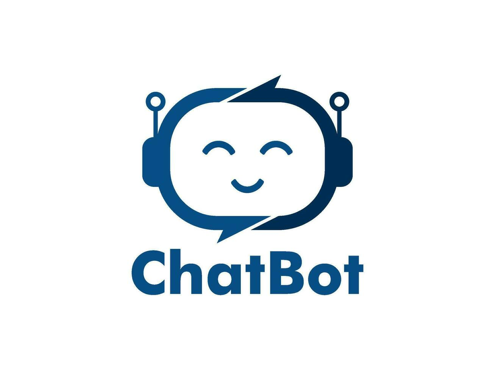
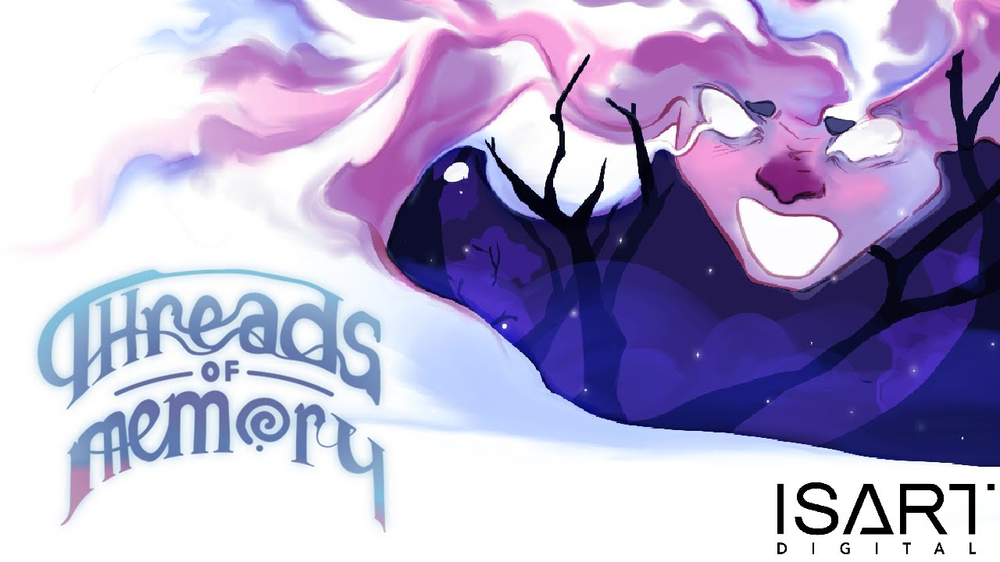
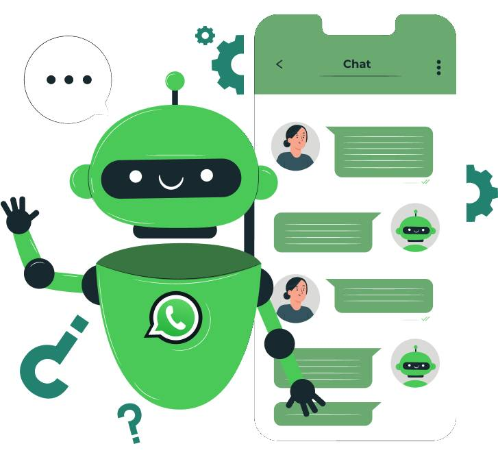
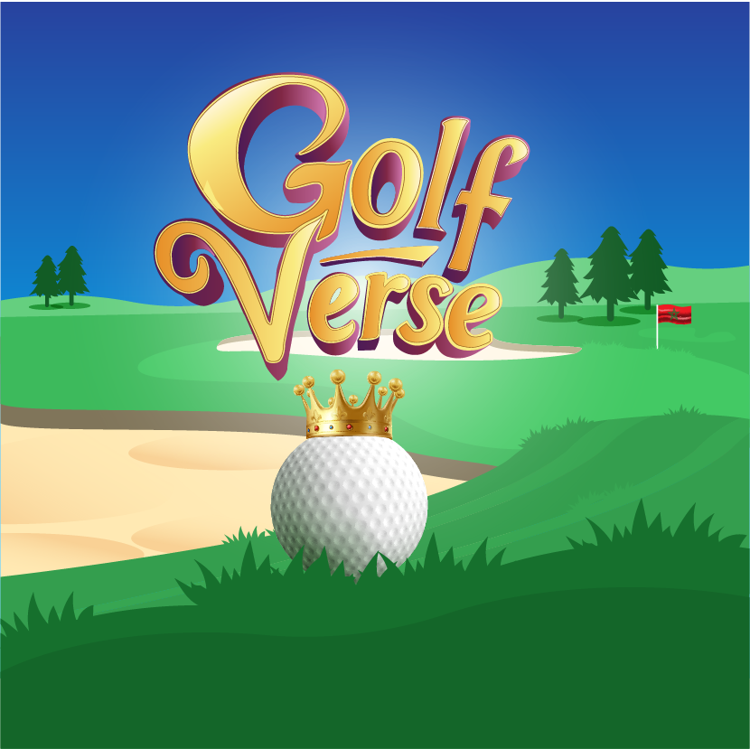

# Salout Ilyass

Game Developer 🎮 · AI & Automation Specialist · Full‑Stack Developer

📍 Morocco, Casablanca‑Settat

---

## About Me

Full‑stack developer and aspiring game developer passionate about building immersive experiences and practical AI solutions. I blend software engineering with creative problem‑solving, focusing on user experience, reliability, and clean architecture.

- Pursuing a Master’s in Computer Engineering & Big Data (ENSA)
- Certified through ISART Digital’s Video Game Creator program (affiliated with the Ministry of Youth, French Embassy, and UIR)
- Comfortable working across product, support, and engineering to deliver clear, effective solutions

---

## Skills

- 🎮 Game Development
  - Unity, Unreal Engine 5, gameplay systems, physics, polish
- 🌐 Web Development
  - Laravel, React, Python (Flask), REST APIs, caching, integration
- 🤖 AI & Machine Learning
  - Chatbots, computer vision, model integration, automation pipelines
- 🐍 Automation & Scripting
  - Python, RPA techniques, scripting for reliability and monitoring

Languages: French — C1 · English — C1 · Arabic — Native

---

## Featured Projects

### Website to Chatbot Builder

Web platform for building and deploying AI‑powered chatbots with customizable interfaces, advanced caching, conversation memory, and seamless website integration.

---

### ArtTimeLapse — Frame‑based Screen Recorder

Capture clean timelapses of your art process on Windows. Click‑drag to select a region, record at intervals, and export a single smooth GIF or MP4.

---

### Threads of Memory

A dreamlike puzzle‑adventure inviting players to explore a forgotten world filled with mystery and wonder.

---

### WhatsApp Bot Desktop App

Local, lightweight desktop automation focused on sending messages reliably to a specific contact.

---

### GolfVerse

Stylized 3D golf prototype focusing on physics, feel, and polish. Currently under deployment.

If video playback is blocked, open directly on Thumbsnap:
[Open video](https://thumbsnap.com/egQgAckZ)

---

## Experience

### Bilingual Customer Service Advisor — Xceed

- Handled high‑volume inbound calls with professionalism and empathy
- Identified customer needs and proposed relevant products to improve satisfaction and revenue
- Consistently met monthly targets through clear communication and strong relationships
- Maintained service quality via documentation and timely incident resolution

### Support Technician — HPS

- Maintained PowerCard payment systems on Unix; resolved transaction incidents swiftly
- Implemented software updates and patches while coordinating to minimize disruptions
- Analyzed transactional data with PL/SQL to identify trends and optimize performance
- Developed automation scripts in C and Java to enhance monitoring and operational efficiency
- Collaborated across teams to resolve technical issues and ensure compliance

---

## Education

- Master’s in Computer Engineering & Big Data — ENSA
- ISART Digital affiliation: Video Game Creator program
  - Partners: Ministry of Youth, French Embassy, UIR

---

## Resumes

- [Resume (EN)](assets/Ilyass_Salout_Full_Stack_Developer_EN.pdf)
- [CV (FR)](assets/Ilyass_Salout_Full_Stack_Developer_FR.pdf)

---

## How This Portfolio Is Built

- Frontend: HTML, CSS, vanilla JS
- Internationalization (EN/FR) with a simple client‑side dictionary
- Theming with `data-theme` and localStorage persistence
- Media modal for project preview with graceful fallbacks

---

## Get In Touch

I’m open to opportunities in game development, AI, and full‑stack roles. Feel free to reach out via GitHub.

---

© 2025 Salout Ilyass. Built with passion for technology and innovation.
