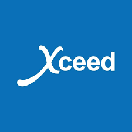
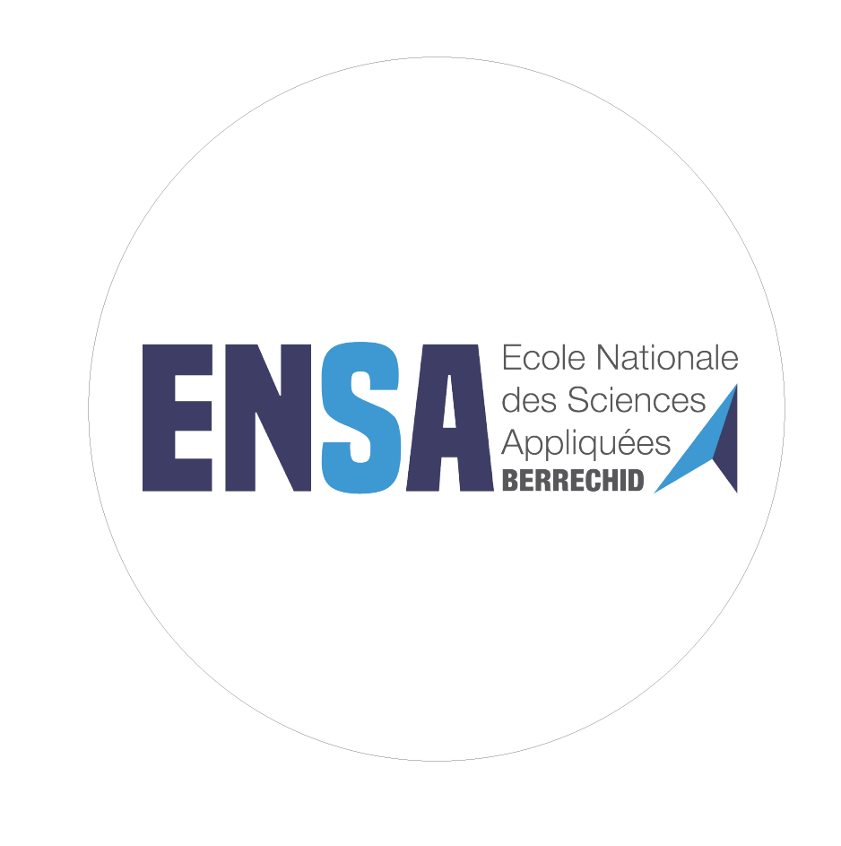
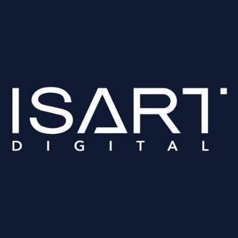

  <h1>Salout Ilyass</h1>
  

    Game Developer 🎮 · AI & Automation Specialist · Full‑Stack Developer 
    📍 Morocco, Casablanca‑Settat
  

  
  
  
  

   
  
  

---

## About Me

Full‑stack developer and aspiring game developer passionate about building immersive experiences and practical AI solutions. I blend software engineering with creative problem‑solving, focusing on user experience, reliability, and clean architecture.

- Pursuing a Master’s in Computer Engineering & Big Data (ENSA)
- Certified through ISART Digital’s Video Game Creator program (affiliated with the Ministry of Youth, French Embassy, and UIR)
- Comfortable working across product, support, and engineering to deliver clear, effective solutions

---

## Skills

### Tech Stack (logos)
Only technologies I actively use and can demonstrate.

  <!-- Game Dev -->
  
  
  
  
  
  <!-- Web -->
  
  
  
  
  
  
  
  

  <!-- Backend / Scripting -->
  
  
  
  

  <!-- AI / ML -->
  
  
  
  
  

  <!-- Automation -->
  

  <!-- Tools / DB -->
  
  

### Domains

- 🎮 Game Development — Unity, Unreal Engine 5, gameplay systems, physics, polish
- 🌐 Web Development — Laravel, React, Python (Flask), REST APIs, caching, integration
- 🤖 AI & Machine Learning — Chatbots, computer vision, model integration, automation pipelines
- 🐍 Automation & Scripting — Python, RPA techniques, scripting for reliability and monitoring

Languages: French — C1 · English — C1 · Arabic — Native

---

<!-- Featured Projects section intentionally removed per request -->

## Experience

### Bilingual Customer Service Advisor — Xceed

- Handled high‑volume inbound calls with professionalism and empathy
- Identified customer needs and proposed relevant products to improve satisfaction and revenue
- Consistently met monthly targets through clear communication and strong relationships
- Maintained service quality via documentation and timely incident resolution

### Support Technician — HPS

- Maintained PowerCard payment systems on Unix; resolved transaction incidents swiftly
- Implemented software updates and patches while coordinating to minimize disruptions
- Analyzed transactional data with PL/SQL to identify trends and optimize performance
- Developed automation scripts in C and Java to enhance monitoring and operational efficiency
- Collaborated across teams to resolve technical issues and ensure compliance

---

## Education

- Master’s in Computer Engineering & Big Data — ENSA
  
  

- ISART Digital affiliation: Video Game Creator program
  - Partners: Ministry of Youth, French Embassy, UIR
  
  

---

## Resumes

- [Resume (EN)](assets/Ilyass_Salout_Full_Stack_Developer_EN.pdf)
- [CV (FR)](assets/Ilyass_Salout_Full_Stack_Developer_FR.pdf)

---

## How This Portfolio Is Built

- Frontend: HTML, CSS, vanilla JS
- Internationalization (EN/FR) with a simple client‑side dictionary
- Theming with `data-theme` and localStorage persistence
- Media modal for project preview with graceful fallbacks

---

## Get In Touch

I’m open to opportunities in game development, AI, and full‑stack roles.

- Portfolio: [ilyass-portfolio.rf.gd](https://ilyass-portfolio.rf.gd/)
- LinkedIn: [linkedin.com/in/ilyass-salout](https://www.linkedin.com/in/ilyass-salout/)

---

© 2025 Salout Ilyass. Built with passion for technology and innovation.
